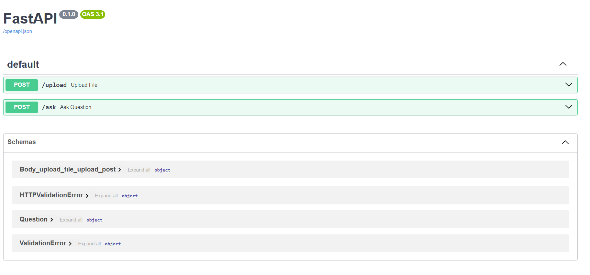
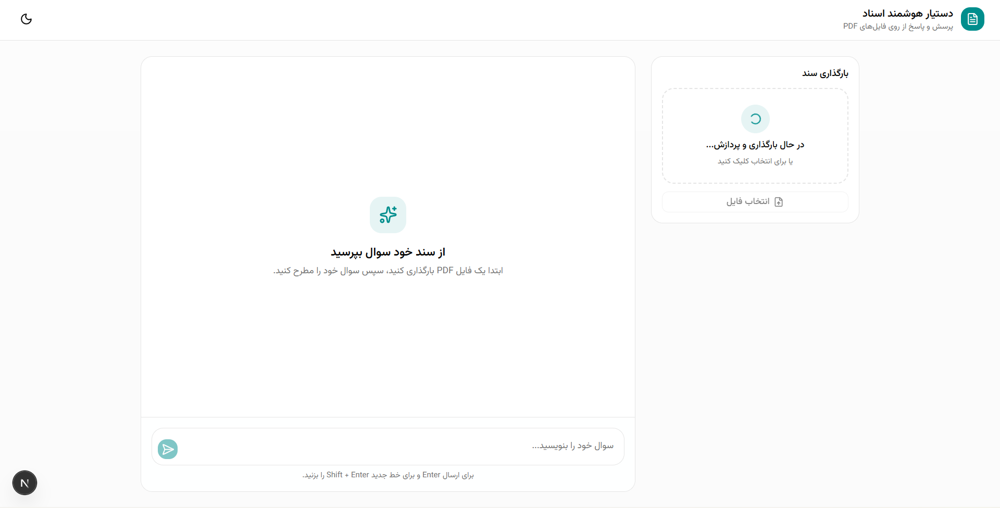
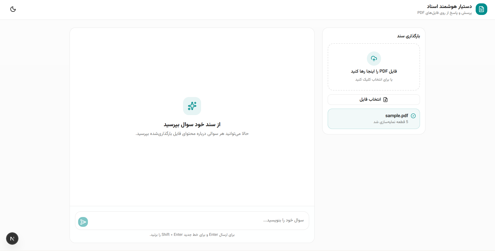
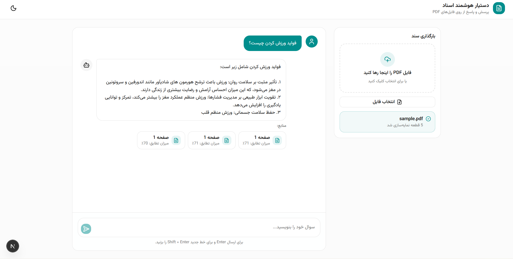

A Persian Document Question Answering System
powered by Retrieval-Augmented Generation (RAG)

# 🧠 DaanRAG — Persian Document Question Answering

A production-oriented **Retrieval-Augmented Generation (RAG)** system for asking questions from Persian PDF documents.

The system extracts Persian text from PDF files, splits the text into meaningful chunks, converts the chunks into vector embeddings, stores them in **Qdrant**, retrieves the most relevant information based on the user's question, and generates a Persian answer using **Qwen**.

---

## ✨ Features

| Feature            | Description                                      |
| ------------------ | ------------------------------------------------ |
| 📄 PDF Upload      | Upload Persian PDF documents                     |
| ✂️ Text Chunking   | Split documents into overlapping chunks          |
| 🔎 Semantic Search | Retrieve relevant chunks using vector similarity |
| 🧠 Embeddings      | Generate embeddings using BGE-M3                 |
| 🤖 LLM Answering   | Generate Persian answers using Qwen              |
| 📚 Source Tracking | Display the page number of retrieved information |
| 🚀 REST API        | FastAPI-based API                                |
| 🐳 Docker Ready    | Containerized application                        |
| 📖 Swagger         | Interactive API documentation                    |

---

## 🏗️ Architecture

The project follows a **Retrieval-Augmented Generation (RAG)** architecture.

```text
                    ┌─────────────────┐
                    │   User Uploads  │
                    │       PDF       │
                    └────────┬────────┘
                             │
                             ▼
                    ┌─────────────────┐
                    │   PDF Reader    │
                    │   pdfplumber    │
                    └────────┬────────┘
                             │
                             ▼
                    ┌─────────────────┐
                    │    Chunking     │
                    │  Overlap = 100   │
                    └────────┬────────┘
                             │
                             ▼
                    ┌─────────────────┐
                    │  BGE-M3 Model   │
                    │   Embeddings    │
                    └────────┬────────┘
                             │
                             ▼
                    ┌─────────────────┐
                    │     Qdrant      │
                    │  Vector Storage  │
                    └─────────────────┘


User Question
      │
      ▼
┌───────────────┐
│ BGE-M3 Query  │
│   Embedding   │
└───────┬───────┘
        │
        ▼
┌───────────────┐
│ Qdrant Search │
│ Top-K Chunks  │
└───────┬───────┘
        │
        ▼
┌───────────────┐
│    Qwen LLM   │
│ Context + Q   │
└───────┬───────┘
        │
        ▼
┌───────────────┐
│ Answer + Source│
└───────────────┘
```

### 🔄 RAG Pipeline

```text
PDF
 ↓
Text Extraction
 ↓
Chunking
 ↓
Embedding
 ↓
Vector Database
 ↓
Question Embedding
 ↓
Similarity Search
 ↓
Context Retrieval
 ↓
Qwen
 ↓
Answer + Source
```

---

## 🧰 Tech Stack

| Technology            | Purpose                      |
| --------------------- | ---------------------------- |
| Python                | Main programming language    |
| FastAPI               | REST API                     |
| pdfplumber            | Persian PDF text extraction  |
| Sentence Transformers | Text embedding               |
| BAAI/bge-m3           | Multilingual embedding model |
| Qdrant                | Vector database              |
| Qwen2.5-1.5B-Instruct | Language model               |
| PyTorch               | Deep learning framework      |
| Docker                | Containerization             |

---

## 🤖 Models

The models are automatically downloaded from Hugging Face on the first run.

### 🔹 Embedding Model

**BAAI/bge-m3**

Used for converting Persian text and user questions into vector embeddings.

```text
BAAI/bge-m3
```

### 🔹 Language Model

**Qwen2.5-1.5B-Instruct**

Used for generating Persian answers based on the retrieved context.

```text
Qwen/Qwen2.5-1.5B-Instruct
```

> The models are not included in this repository.

---

## 📁 Project Structure

```text
DaanRag/
│
├── api/
│   └── apimain.py
│
├── src/
│   ├── reader.py
│   └── chunck.py
│
├── data/
│   └── uploads/
│
├── screenshots/
│
├── Dockerfile
├── requirements.txt
├── README.md
├── .gitignore
└── .dockerignore
```

---

## ⚙️ Installation

### 1️⃣ Clone the Repository

```bash
git clone <https://github.com/MastRT/DaanRag>
```

```bash
cd DaanRag
```

---

### 2️⃣ Create a Virtual Environment

```bash
python -m venv venv
```

#### Windows

```bash
venv\Scripts\activate
```

#### Linux / macOS

```bash
source venv/bin/activate
```

---

### 3️⃣ Install Dependencies

```bash
pip install -r requirements.txt
```

---

## 🚀 Run the Project

Start the FastAPI server:

```bash
uvicorn api.main:app --reload
```

The API will be available at:

```text
http://127.0.0.1:8000
```

---

## 📖 Swagger API Documentation

After running the server, open:

```text
http://127.0.0.1:8000/docs
```

Swagger provides an interactive interface for testing the API.

---

# 🔌 API Usage

## 📄 1. Upload PDF

### Endpoint

```text
POST /upload
```

### Description

Uploads a PDF file and indexes its content in the vector database.

### Processing Pipeline

```text
PDF
 ↓
Text Extraction
 ↓
Chunking
 ↓
BGE-M3 Embedding
 ↓
Qdrant
```

### Example

```text
POST /upload
```

### Response

```json
{
  "filename": "sample.pdf",
  "chunks": 13,
  "message": "file uploaded and indexed successfully"
}
```

---

## ❓ 2. Ask a Question

### Endpoint

```text
POST /ask
```

### Request

```json
{
  "question": "مهمترین فایده ورزش چیست؟"
}
```

### Internal Process

```text
Question
   ↓
BGE-M3 Embedding
   ↓
Qdrant Similarity Search
   ↓
Top-K Relevant Chunks
   ↓
Qwen
   ↓
Generated Answer
```

---

## 💬 3. Display Answer

The system generates the answer based only on the retrieved context.

### Example

```text
Answer:

ورزش تأثیر مثبتی بر سلامت جسم و روان دارد و می‌تواند
به کاهش استرس و بهبود وضعیت عمومی بدن کمک کند.
```

The language model is instructed not to generate unsupported information.

---

## 📚 4. Display Sources

The system also returns the source page of the retrieved information.

### Example

```text
Answer:

ورزش تأثیر مثبتی بر سلامت روان دارد.

Source:

📄 Page 16
```

### API Response

```json
{
  "question": "مهمترین فایده ورزش چیست؟",
  "answer": "ورزش تأثیر مثبتی بر سلامت روان دارد.",
  "sources": [
    {
      "page": 16,
      "score": 0.87
    }
  ]
}
```

---

## 🖼️ Screenshots

### Swagger API



### PDF Upload




### Question Answering & Source Retrieval




---

## 🎥 Demo

### Complete RAG Workflow

```text
1. Upload a Persian PDF
2. Extract Persian text
3. Split the document into chunks
4. Generate embeddings
5. Store vectors in Qdrant
6. Ask a question
7. Retrieve the most relevant chunks
8. Generate an answer using Qwen
9. Display the answer and source pages
```

---

## 🐳 Docker

### Build the Image

```bash
docker build -t persian-rag .
```

### Run the Container

```bash
docker run -p 8000:8000 persian-rag
```

The API will be available at:

```text
http://localhost:8000/docs
```

---

## 📦 Requirements

The main dependencies are listed in `requirements.txt`.

```text
fastapi
uvicorn
python-multipart
sentence-transformers
transformers
torch
qdrant-client
pdfplumber
```

---

## 🧠 Design Decisions

### Why RAG?

Instead of training a language model on every new document, RAG retrieves relevant information from the document at query time.

This makes it possible to:

* Add new documents without retraining the LLM
* Reduce hallucination
* Provide source references
* Build domain-specific question-answering systems

---

### Why BGE-M3?

BGE-M3 was selected as the embedding model because it supports multilingual text and provides strong semantic representation for Persian text.

---

### Why Qdrant?

Qdrant is used as the vector database for efficient similarity search over document embeddings.

---

### Why Qwen?

Qwen2.5-1.5B-Instruct is used as the language model for generating Persian answers based on retrieved context.

---

## 🧹 Code Quality

The project follows a modular structure:

```text
API Layer
    ↓
Document Processing
    ↓
Embedding Layer
    ↓
Vector Database
    ↓
LLM Generation
```

Each component has a separate responsibility.

The project avoids mixing:

* PDF processing
* Chunking
* Vector search
* LLM generation

inside a single function.

---

## 🔮 Future Improvements

* [ ] Support multiple documents
* [ ] Add document deletion
* [ ] Add document metadata
* [ ] Improve chunking strategy
* [ ] Add reranking
* [ ] Add streaming responses
* [ ] Add authentication
* [ ] Add PostgreSQL
* [ ] Add production logging
* [ ] Add automated tests
* [ ] Deploy the API

---

## 📄 License

This project is created for educational and portfolio purposes.
